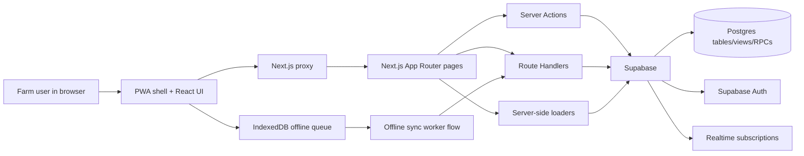
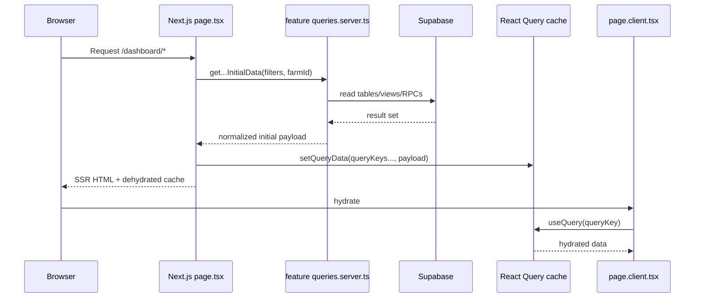
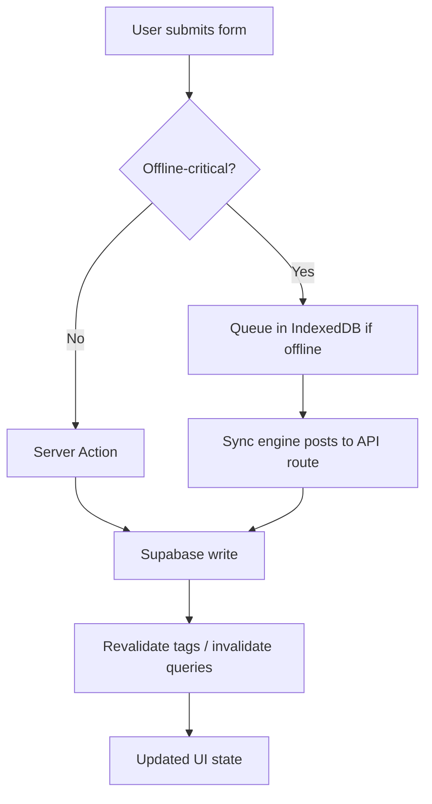

# AquaSmart Documentation

## 1. Purpose

AquaSmart is a full-stack aquaculture operations platform built for day-to-day fish farm management. It combines operational data capture, supervisory dashboards, analytics, reporting, inventory visibility, water-quality monitoring, and role-based farm administration in a single web application.

At a business level, AquaSmart helps a farm team answer five continuous questions:

- What is happening in the farm right now?
- What was recorded today across feeding, mortality, sampling, water quality, stocking, transfer, and harvest?
- Are any systems drifting into operational risk?
- Do feed, population, production, and water-quality trends support the current plan?
- Which users can access which farm workspace functions?

This document combines direct repository inspection with current framework guidance from:

- Next.js App Router project-structure and routing guidance
- TanStack Query advanced SSR and hydration guidance
- Supabase Next.js server-side auth guidance
- Modern cloud/application architecture documentation patterns

Reference links are listed in the final section.

---

## 2. Product Scope

### 2.1 Core product capabilities

AquaSmart currently supports:

- Authentication and session management using Supabase Auth and Google OAuth
- Farm onboarding and workspace bootstrapping
- Multi-role access control at the farm level
- Farm dashboard summaries and operational intelligence
- Feed management and feed inventory visibility
- Sampling and growth analysis
- Mortality tracking and investigation support
- Water-quality monitoring, thresholds, alerts, and status tracking
- Production analysis and benchmarking
- Reports for performance, feeding, growth, mortality, and water-quality compliance
- Structured operational data entry
- Farm profile management and team/user access management
- Progressive Web App behavior and offline capture for critical field workflows

### 2.2 Product areas

The UI follows four product groupings:

- **Operate**: dashboard, feed, growth, mortality, water quality
- **Analyze**: production and reports
- **Capture**: structured data entry
- **Configure**: settings and user access

---

## 3. User Roles and Access Model

### 3.1 Supported roles

The system defines these farm roles:

- `admin`
- `farm_manager`
- `farm_technician`
- `inventory_storekeeper`
- `analyst_planner`
- `viewer_auditor`

### 3.2 Role-driven entry paths

The application computes a default landing path per role:

- `admin` -> `/dashboard`
- `farm_manager` -> `/dashboard`
- `farm_technician` -> `/data-entry?type=feeding`
- `inventory_storekeeper` -> `/data-entry?type=incoming_feed`
- `analyst_planner` -> `/dashboard/production`
- `viewer_auditor` -> `/dashboard`

### 3.3 Navigation visibility by role

| Role | Main access |
|---|---|
| `admin` | Full dashboard, analytics, data entry, settings, users |
| `farm_manager` | Full dashboard, analytics, data entry, settings |
| `farm_technician` | Feed, growth, mortality, water quality, data entry |
| `inventory_storekeeper` | Data entry only, focused on feed inventory |
| `analyst_planner` | Dashboard, production, reports |
| `viewer_auditor` | Dashboard and reports |

### 3.4 Access-control rules

Important enforced rules include:

- Only `admin`, `farm_manager`, `farm_technician`, and `inventory_storekeeper` can access data entry.
- Only `admin` and `farm_manager` can access settings.
- Only `admin` and `farm_manager` can manage team members and farm access.
- Role assignment is treated as farm membership data, not a general profile preference.
- The settings page does not write farm membership role changes directly; role changes are intentionally handled through the users page to respect authorization boundaries.

---

## 4. Primary User Journeys

### 4.1 Authentication journey

1. User opens `/auth`
2. User authenticates with Google OAuth
3. Supabase completes the callback at `/auth/callback`
4. AquaSmart loads session and membership context
5. If the user has no farm membership, AquaSmart routes them to `/onboarding`
6. If the user has a membership, AquaSmart routes them to their role-appropriate entry path

### 4.2 Onboarding journey

Onboarding handles two related cases:

- profile completion for an already invited user
- workspace bootstrap for a user who must create the first farm workspace

The onboarding page collects:

- full name
- effective role
- linked farm context if already assigned

On completion, AquaSmart:

- updates Supabase user metadata
- upserts `user_profile`
- upserts `farm_user` when a farm assignment exists
- refreshes client session/profile state

### 4.3 Daily operations journey

For farm operations, the common loop is:

1. Enter or sync farm data
2. Review dashboard and feature screens
3. Detect exceptions, alerts, and performance drift
4. Take corrective action
5. Re-check updated metrics and reports

### 4.4 Data-entry journey

Operators can log:

- feeding
- mortality
- sampling
- water quality
- harvest
- transfer
- stocking
- incoming feed inventory
- system setup

The interface also shows recent entries per operation type as immediate confirmation.

---

## 5. Functional Inventory

### 5.1 Public and auth routes

- `/` - marketing landing page for signed-out users; dashboard shell entry for signed-in users
- `/auth` - Google OAuth sign-in experience
- `/auth/callback` - auth code exchange and redirect completion
- `/auth/auth-error` - auth failure state
- `/onboarding` - membership/profile completion and optional workspace creation

### 5.2 Canonical application routes

Dashboard, analytics, and management pages live under `/dashboard/*`. Data entry is a separate canonical capture route:

- `/dashboard`
- `/dashboard/actions`
- `/dashboard/feed`
- `/dashboard/mortality`
- `/dashboard/production`
- `/dashboard/reports`
- `/dashboard/sampling`
- `/dashboard/settings`
- `/users`
- `/dashboard/water-quality`
- `/data-entry`

Legacy root aliases are no longer implemented as route files; they are handled centrally in `src/proxy.ts` and redirected to `/dashboard/*`.

### 5.3 Dashboard home

The dashboard home is the farm command center. It presents:

- KPI overview
- system health overview
- water-quality index
- unified feed, mortality, and ABW trend chart
- compact systems table
- recent activities
- recommended actions

Production summary metrics live in `/dashboard/production`. Harvest forecast lives in `/dashboard/sampling`.

### 5.4 Feed module

The feed page acts as a feed control tower and includes:

- feeding performance views
- feed-rate and FCR trend analysis
- feed inventory context
- stock coverage and demand visibility
- feed-delivery / incoming-feed visibility
- water-quality overlays that help explain feeding behavior

### 5.5 Sampling / growth module

The sampling route focuses on biomass and growth understanding, including:

- sampling history
- ABW and growth progress
- system- and batch-scoped growth views
- trend-oriented analysis of sampling outcomes

### 5.6 Mortality module

The mortality route supports:

- mortality event review
- alerts and exception detection
- survival-trend views
- mortality investigation support
- cross-checking with feeding, sampling, and measurements

### 5.7 Water-quality module

The water-quality route is a full operational monitoring surface with:

- overview tab
- parameter analysis tab
- environmental indicators tab
- stratification/depth analysis tab
- alerts tab
- system coverage tab

It also includes:

- latest status
- daily ratings
- threshold evaluation
- measurement history
- overlays with other operational signals
- recent water-quality activities

### 5.8 Production module

The production route focuses on farm performance analysis, including:

- production summaries
- inventory context
- cycle benchmarks
- system and batch scoping
- trend interpretation for analysts and planners

### 5.9 Reports module

Reports are grouped into:

- performance report
- feeding report
- growth report
- mortality report
- water-quality compliance report

The route is designed for export-oriented, filter-driven analysis rather than raw data capture.

### 5.10 Settings module

Settings covers:

- farm profile details
- alert threshold management
- account/farm-level settings views

### 5.11 Team / users module

The users page is the farm-access administration surface. It supports:

- listing current farm members
- assigning farm access to existing AquaSmart users
- choosing the invited member’s role

### 5.12 Data-entry module

Data entry includes dedicated forms for:

- feeding
- mortality
- sampling
- water quality
- harvest
- transfer
- stocking
- incoming feed inventory
- system setup

This module is the operational capture hub for daily farm work.

The canonical screen is `/data-entry`. The legacy `/dashboard/data-entry` route is kept only as a redirect stub.

---

## 6. Business Logic

### 6.1 Farm membership model

The product distinguishes between:

- identity (`auth.users` via Supabase Auth)
- user profile (`user_profile`)
- farm membership (`farm_user`)

This means a person’s global identity and their farm-specific access are related but not the same thing.

### 6.2 Active farm selection

A user can belong to one or more farm workspaces. AquaSmart resolves an active farm using:

1. a URL `farmId` when present
2. local storage for the current user
3. the first available farm membership as a fallback

This allows the UI to maintain a stable active-farm context while still supporting farm switching.

### 6.3 Role-aware default workboard

The app does not send every user to the same dashboard surface. Instead it routes each role to the workboard that best matches their operational intent.

Examples:

- technicians land on feeding-oriented data entry
- inventory storekeepers land on feed-inventory entry
- analysts land on production analysis

### 6.4 Threshold logic

Alert thresholds can exist at:

- farm scope
- system scope

When evaluating a system, AquaSmart prefers the system-specific threshold and falls back to a farm-level threshold when needed.

### 6.5 Notifications logic

The notification subsystem builds alert notifications from:

- current systems in the active farm
- configured thresholds
- live inserts in water-quality and inventory-like operational tables

Notifications are:

- stored locally for recent history
- surfaced as toasts when enabled
- tracked with read/unread state

### 6.6 Settings write rules

The settings page intentionally does not write role membership changes. That logic is isolated to the users page because:

- role assignment is authorization-sensitive
- membership is farm-scoped
- writing `farm_user` from a general settings form would violate the intended permission boundary

### 6.7 Offline capture boundary

Not all writes are treated the same.

Offline-critical workflows remain API-route based so they can be queued and replayed:

- feeding
- mortality
- sampling
- stocking
- transfer
- harvest
- water quality

Online-only workflows use Server Actions:

- system creation
- feed supplier creation
- feed type creation
- feed inventory snapshot recording
- fingerling supplier creation
- fingerling batch creation
- onboarding completion
- onboarding workspace bootstrap
- team access grants

This hybrid model is deliberate and central to the business behavior of the system.

---

## 7. System Architecture

### 7.1 Architecture style

AquaSmart is a server-rendered, App Router-based web application with:

- a React client shell
- Next.js server-rendered routes
- Supabase as the backend platform
- React Query for client cache and hydration
- IndexedDB and service-worker support for offline capture

It is best described as a modern full-stack web application with:

- SSR + client hydration
- BFF-like route composition in Next.js
- database-backed business logic in Supabase tables, views, and RPCs
- hybrid online/offline write handling

### 7.2 High-level system context



### 7.3 Runtime layers

The system has five practical layers:

1. **UI layer** - pages, widgets, forms, navigation, and layout
2. **Client data layer** - React Query hooks, offline queue hooks, local state
3. **Server composition layer** - App Router pages, feature server loaders, hydration boundaries
4. **Mutation layer** - Server Actions for online-only writes; API routes for offline-capable writes
5. **Backend platform layer** - Supabase Auth, Postgres, views, RPCs, policies, and realtime

---

## 8. Source-Code Architecture

### 8.1 Top-level structure

```text
src/
  app/          Next.js routes and page composition
  components/   shared and route-level UI building blocks
  features/     feature-scoped server reads and writes
  lib/          infra, hooks, offline system, Supabase clients, cache helpers
  proxy.ts      request interception, auth redirecting, legacy route mapping
```

### 8.2 `src/app`

`src/app` owns route composition, not core business logic.

Its responsibilities include:

- route files
- page shell composition
- `HydrationBoundary` setup
- route-level auth gating
- loading and error boundaries

### 8.3 `src/features`

`src/features` owns domain-facing server logic.

Important feature slices:

- `dashboard`
- `data-entry`
- `farm`
- `feed`
- `mortality`
- `onboarding`
- `production`
- `reports`
- `sampling`
- `settings`
- `water-quality`
- `shared`

Typical responsibilities inside a feature slice:

- server query loaders in `queries.server.ts`
- server mutations in `mutations.server.ts`
- feature-local shaping and validation

### 8.4 `src/lib`

`src/lib` holds shared infrastructure:

- Supabase clients
- cache keys and tags
- React Query hooks
- API wrappers
- offline DB and sync engine
- generic server helpers
- shared domain utility functions

### 8.5 `src/components`

`src/components` contains shared UI and some route-level composition building blocks, including:

- data-entry forms
- report presentations
- layout and navigation components
- notification provider
- shared visual primitives

---

## 9. Request, Read, and Hydration Design

### 9.1 Read-path standard

The app now uses a standard SSR-to-CSR data flow:

1. A page route parses filters and auth context
2. The route calls a feature server loader in `src/features/*/queries.server.ts`
3. The route seeds a server `QueryClient`
4. The route wraps the client tree in `HydrationBoundary`
5. Client hooks read from the hydrated React Query cache

### 9.2 Why this matters

This pattern provides:

- complete server-rendered first paint
- stable cache identity across server and client
- removal of old prop-based `initialData` wiring
- consistent query ownership per route

### 9.3 Read-path diagram



### 9.4 Feature read loaders

Feature server loaders exist for:

- dashboard
- feed
- mortality
- water-quality
- production
- reports
- sampling
- data-entry
- settings
- onboarding

---

## 10. Mutation Design

### 10.1 Hybrid mutation model

The mutation layer intentionally mixes two strategies.

#### Server Actions for online-only writes

Server Actions are used where offline queueing is not required.

These include:

- system creation
- feed supplier creation
- feed type creation
- feed inventory snapshot recording
- fingerling supplier creation
- fingerling batch creation
- onboarding profile completion
- onboarding workspace bootstrap
- farm access grant

#### API routes for offline-critical writes

API routes remain the write surface for operations that may be captured offline and replayed later.

These include:

- feeding
- mortality
- sampling
- stocking
- transfer
- harvest
- water quality

### 10.2 Mutation flow diagram



### 10.3 Dashboard and data-entry feedback flow

Data entry is the write surface. Dashboard is the read and decision surface.

```text
Data Entry Form
  -> API route or Server Action
  -> Supabase table write
  -> invalidateAfterWrite()
  -> React Query dashboard/read-model invalidation
  -> Dashboard widgets refresh from analytics/report queries
```

The main connected modules are:

```text
src/app/dashboard/page.tsx
  -> getDashboardPageInitialData()
  -> HydrationBoundary
  -> DashboardLayout
     -> DashboardHeader
     -> KPIOverview
     -> SystemHealthOverview
     -> WaterQualityIndex
     -> PopulationOverview
     -> SystemsTable
     -> RecentActivities
     -> RecommendedActions

src/app/data-entry/page.tsx
  -> getDataEntryPrefetch()
  -> HydrationBoundary
  -> page.client.tsx
     -> DataEntryInterface
        -> FeedingForm
        -> SamplingForm
        -> MortalityForm
        -> TransferForm
        -> StockingForm
        -> IncomingFeedForm
        -> HarvestForm
        -> WaterQualityForm
        -> SystemForm
        -> RecentEntriesList
```

Dashboard SSR hydration is intentionally limited to dashboard read queries. Data-entry forms stay client-side and use write hooks for validation, mutation, optimistic recent-entry feedback, and cache invalidation.

### 10.4 Why the hybrid model exists

This design preserves:

- offline parity for field operations
- modern server-side writes where fetch round-trips are unnecessary
- a clearer separation between transactional farm events and configuration/admin writes

---

## 11. Offline and PWA Design

### 11.1 PWA support

The app uses `@ducanh2912/next-pwa` to provide a service worker, cached assets, and offline-friendly navigation behavior.

### 11.2 Offline storage

IndexedDB stores pending records for critical field events through the offline module in `src/lib/offline`.

Queued domains include:

- feeding
- mortality
- water quality
- sampling
- stocking
- transfer
- harvest

### 11.3 Sync engine

The sync engine:

- reads queued local records
- maps them to the matching API route
- builds request payloads
- pushes them when connectivity allows
- marks push outcomes as pushed, conflict, error, or missing

### 11.4 Why only some operations are offline

The offline queue targets operational field events where delayed capture is acceptable and valuable. Administrative configuration changes are not modeled the same way because they are better handled as direct online actions.

---

## 12. Supabase Backend Design

### 12.1 Supabase responsibilities

Supabase provides:

- authentication
- server and browser session handling
- PostgreSQL storage
- views and RPC-backed analytics
- realtime subscriptions
- service-role access for privileged server operations

### 12.2 Supabase client types

The app uses separate clients for distinct purposes:

- browser client for client-side session-aware operations
- server client for SSR and authenticated route handling
- access-token client for server loaders using the current user session
- admin client for privileged workflows such as onboarding bootstrap

### 12.3 Backend data sources

The system reads from a mix of:

- base tables
- SQL views
- RPCs / database functions
- analytics-oriented consolidated datasets

### 12.4 Read-model direction

The current analytics architecture points to a consolidated read model around system-day analytics and dashboard RPCs, reducing repeated recomputation inside the web layer.

---

## 13. Core Data Model

### 13.1 Identity and tenancy

Key tenancy and user tables:

- `farm`
- `farm_user`
- `user_profile`

### 13.2 Production and system entities

Key production entities include:

- `system`
- fingerling batch entities
- production summary and inventory views

### 13.3 Feed entities

Key feed entities include:

- `feed_supplier`
- `feed_type`
- `feed_incoming`
- `feeding_record`

### 13.4 Fish lifecycle event entities

Key farm-event entities include:

- `fish_stocking`
- `fish_sampling_weight`
- `fish_mortality`
- `fish_transfer`
- `fish_harvest`

### 13.5 Water-quality entities

Key water-quality entities include:

- `water_quality_measurement`
- daily rating views
- latest status views
- `alert_threshold`

### 13.6 Analytics and reporting entities

The application also depends on reporting and analytics projections such as:

- recent entries feeds
- recent activities feeds
- trend RPCs
- benchmark / forecast RPCs
- consolidated dashboard outputs

---

## 14. Feature-by-Feature Business Logic

### 14.1 Dashboard

The dashboard is not just a summary page. It is the cross-feature decision surface.

It combines:

- KPI snapshots
- production summaries
- system health scores
- water-quality status
- recommended actions
- recent activities
- forecast signals

Its business purpose is to help users decide what needs attention now.

### 14.2 Feed

The feed module combines operational feed records with inventory and analytical interpretation. It is where feed behavior, feed stock, and feed performance come together.

Typical business questions answered here:

- Are systems being fed as expected?
- Is feed conversion trending favorably?
- Are there systems deviating from expected feed rate or feed response?
- Is current feed stock sufficient?

### 14.3 Sampling

Sampling translates measurement activity into growth interpretation. It helps connect field sampling to production planning.

Typical business questions:

- Is average body weight moving as expected?
- Which systems or batches are underperforming?
- Do growth signals support current feeding and harvest planning?

### 14.4 Mortality

Mortality exists as both a raw-event stream and a risk-analysis surface.

Typical business questions:

- Where are abnormal losses happening?
- Are there mass mortality patterns?
- Are mortality changes correlated with feeding, sampling, or water quality?
- Is survival trend acceptable over the selected period?

### 14.5 Water quality

This is a monitoring and control surface, not only a logbook.

Typical business questions:

- Which systems are currently out of threshold?
- How has water quality changed over time?
- Is the latest reading acceptable?
- Are environmental patterns or stratification contributing to risk?

### 14.6 Production

Production aggregates farm activity into planning and benchmarking views.

Typical business questions:

- How is the farm performing overall?
- Which systems or batches are strongest or weakest?
- How do current cycles compare with benchmark expectations?

### 14.7 Reports

Reports turn operational data into reviewable and exportable analysis. These reports are designed for management review, planning, and audit-like consumption.

### 14.8 Settings and users

These features define the farm’s administrative operating envelope:

- threshold defaults
- workspace identity
- who can access the workspace
- what role each teammate has inside the farm

---

## 15. Query and Cache Design

### 15.1 Query keys

The application uses centralized React Query key factories in `src/lib/cache/query-keys.ts`.

This standardizes cache identity for:

- options
- inventory
- production
- reports
- analytics
- farm role and app config
- time bounds
- onboarding state
- settings loads and members

### 15.2 Cache hydration

Each canonical route seeds the exact query keys that its client components consume. This removes the older pattern of page props carrying large `initialData` payloads through component trees.

### 15.3 Cache invalidation

Writes update UI state through a combination of:

- revalidation tags for server data freshness
- React Query invalidation for client cache freshness
- direct optimistic updates where appropriate

Data-entry writes go through `invalidateAfterWrite()` in `src/lib/cache/react-query.ts`. That centralized path invalidates the connected dashboard query families for the active farm, including:

- dashboard overview keys such as systems overview, KPI overview, production trend, and recommended actions
- analytics keys such as health scores, forecasts, scoped actions, feed-rate analysis, and KPI coverage
- farm-scoped report keys, including recent entries
- water-quality keys when water-quality measurements are written
- production summary keys when production-affecting events are written

---

## 16. Notifications and Realtime Behavior

### 16.1 Notification source model

Notifications are assembled from:

- threshold definitions
- current farm systems
- new water-quality or mortality-relevant inserts

### 16.2 Realtime subscriptions

The notifications provider subscribes to farm-relevant changes and invalidates threshold data when needed. It also watches new measurement events for alert generation.

### 16.3 Local persistence

Notification history is persisted in browser storage so the user keeps a recent alert history across refreshes.

---

## 17. Route and API Inventory

### 17.1 Interactive pages

- `/`
- `/auth`
- `/auth/auth-error`
- `/onboarding`
- `/data-entry`
- `/dashboard`
- `/dashboard/actions`
- `/dashboard/feed`
- `/dashboard/mortality`
- `/dashboard/production`
- `/dashboard/reports`
- `/dashboard/sampling`
- `/dashboard/settings`
- `/users`
- `/dashboard/water-quality`

### 17.2 API write routes

Offline-critical record APIs:

- `/api/feeding/record`
- `/api/mortality/record`
- `/api/sampling/record`
- `/api/stocking/record`
- `/api/transfer/record`
- `/api/harvest/record`
- `/api/water-quality/record`

### 17.3 API read/query routes

Query endpoints exist for:

- mortality alerts/events/survival trend
- report feeds such as recent entries, feeding records, growth trend, transfer, sampling, mortality, harvests, and more

### 17.4 Health endpoints

- `/api/health/live` - liveness probe
- `/api/health/ready` - readiness probe including env and Supabase checks

---

## 18. Security and Access Control

### 18.1 Session enforcement

`src/proxy.ts` is responsible for:

- session-aware request interception
- redirecting unauthenticated protected requests to `/auth`
- mapping legacy root paths into canonical `/dashboard/*`
- dealing with invalid refresh token states safely

### 18.2 Route gating

The app also uses route-level and client-level gating:

- server-side `requireUser` / `requireUserContext`
- farm onboarding gate
- farm-role gates for settings and data entry

### 18.3 Sensitive writes

Privileged writes such as workspace bootstrap and role assignment use server-side logic and, where necessary, the admin Supabase client.

---

## 19. Deployment and Runtime

### 19.1 Required environment variables

Observed required runtime configuration includes:

- `NEXT_PUBLIC_SUPABASE_URL`
- `NEXT_PUBLIC_SUPABASE_ANON_KEY`
- `SUPABASE_SERVICE_ROLE_KEY`
- `NEXT_PUBLIC_APP_URL` for metadata base / absolute URL behavior

### 19.2 Build/runtime platform assumptions

The application assumes:

- Next.js App Router runtime
- Supabase availability
- service worker generation in production builds
- browser storage availability for some client conveniences such as active farm and notification history

### 19.3 Operational endpoints

The health endpoints are suitable for deployment checks and can be used by hosting platforms or external monitors.

---

## 20. Current Architecture Decisions

The current codebase reflects these deliberate decisions:

1. Canonical routes live only under `/dashboard/*`
2. Route composition stays in `src/app`, while feature-owned server logic lives in `src/features`
3. Server-side hydration is the standard read pattern
4. Online-only mutations use Server Actions
5. Offline-critical mutations stay on API routes
6. Dashboard UI belongs to the dashboard feature slice
7. Shared infra belongs in `src/lib`
8. Notifications, some drilldowns, and some app-state hooks remain intentionally client-first where SSR pre-seeding is not worth the complexity

---

## 21. Known Intentional Exceptions

Not every query is page-hydrated on purpose.

Intentional client-first behavior remains in:

- `src/components/notifications/notifications-provider.tsx`
- `src/components/systems/system-history-sheet.tsx`
- `src/lib/hooks/app/use-active-farm.tsx`
- `src/lib/hooks/use-active-farm-role.ts`

These are kept client-first because they are global, on-demand, or highly interactive app-state flows rather than primary SSR route surfaces.

---

## 22. What AquaSmart Does End-to-End

In plain terms, AquaSmart does the following:

- authenticates farm users with Google
- determines whether they belong to a farm workspace
- guides new users through onboarding or workspace creation
- assigns a role-specific workboard
- lets operators capture farm events online or offline
- syncs queued field data back to the backend when possible
- aggregates operational records into dashboards and reports
- monitors water quality and thresholds
- highlights recommended actions and recent farm activity
- tracks team access and farm settings
- exposes readiness/liveness endpoints for deployment health

It is therefore both:

- an operational execution tool for farm staff
- a supervisory analytics tool for managers and planners

---

## 23. Reference Code Map

Useful anchor files for future maintainers:

- `src/proxy.ts`
- `src/app/layout.tsx`
- `src/components/providers/auth-provider.tsx`
- `src/components/providers/react-query-provider.tsx`
- `src/components/providers/farm-onboarding-gate.tsx`
- `src/lib/app-entry.ts`
- `src/lib/cache/query-keys.ts`
- `src/lib/offline/sync.ts`
- `src/lib/offline/db.ts`
- `src/lib/commands/operations.ts`
- `src/features/dashboard/queries.server.ts`
- `src/features/feed/queries.server.ts`
- `src/features/feed/mutations.server.ts`
- `src/features/mortality/queries.server.ts`
- `src/features/production/queries.server.ts`
- `src/features/reports/queries.server.ts`
- `src/features/sampling/queries.server.ts`
- `src/features/settings/queries.server.ts`
- `src/features/settings/mutations.server.ts`
- `src/features/water-quality/queries.server.ts`
- `src/features/onboarding/queries.server.ts`
- `src/features/onboarding/mutations.server.ts`

---

## 24. External Research Basis

The documentation structure and architectural framing were informed by current external references:

- Next.js project structure and App Router documentation: `https://nextjs.org/docs/app/getting-started/project-structure`
- TanStack Query SSR and hydration guidance: `https://tanstack.com/query/latest/docs/framework/react/guides/advanced-ssr`
- Supabase Next.js SSR authentication guidance: `https://supabase.com/docs/guides/auth/server-side/nextjs`
- Microsoft architecture documentation patterns: `https://learn.microsoft.com/en-us/azure/architecture/guide/architecture-styles/`

These references were used to shape the documentation style and architecture terminology. The AquaSmart-specific content in this document was derived from the repository itself.
